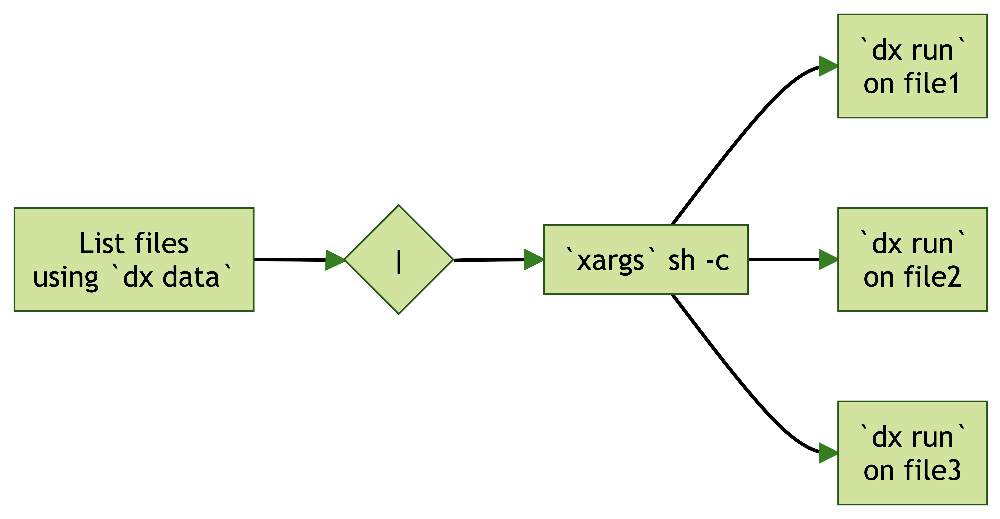

:::::::::::::::::::::::::::::::::::::: questions 

- How do you run batch jobs on the DNAnexus Platform?

::::::::::::::::::::::::::::::::::::::::::::::::

::::::::::::::::::::::::::::::::::::: objectives

- Explain a basic recipe for batch processing on the DNAnexus Platform
- Demonstrate the utility of `dx find data`
- Demonstrate `xargs` and use it to process multiple files.
- Demonstrate `dx run` and use it to process BAM files with the Swiss Army Knife App

::::::::::::::::::::::::::::::::::::::::::::::::

## Introduction

<!--html_preserve--><div class="vembedr">
<div>
<iframe src="https://www.youtube.com/embed/MBFXgfzYCjw" width="533" height="300" frameborder="0" allowfullscreen="" data-external="1"></iframe>
</div>
</div><!--/html_preserve-->

In this section, we'll introduce the basic recipe for batch processing multiple files on the DNAnexus Platform.


The code we start with


```r
dx find data --brief --name *.bam | \
  xargs -I% sh -c \ 
  'dx run app-swiss-army-knife \
   -iin="%" -icmd="sambamba index \${in_name}"'
```

:::::::::::::::::::::::::::::::::::::::::::::::::::::::::::::::::::: instructor

Inline instructor notes can help inform instructors of timing challenges
associated with the lessons. They appear in the "Instructor View"

::::::::::::::::::::::::::::::::::::::::::::::::::::::::::::::::::::::::::::::::

::::::::::::::::::::::::::::::::::::: challenge 

## Challenge 1: Can you do it?

What is the output of this command?

```r
paste("This", "new", "lesson", "looks", "good")
```

:::::::::::::::::::::::: solution 

## Output
 
```output
[1] "This new lesson looks good"
```

:::::::::::::::::::::::::::::::::

:::::::::::::::::::::::::::::::::::::

## `dx find data`


```r
vembedr::embed_youtube("BuIPCTj9gjs")
```

<!--html_preserve--><div class="vembedr">
<div>
<iframe src="https://www.youtube.com/embed/BuIPCTj9gjs" width="533" height="300" frameborder="0" allowfullscreen="" data-external="1"></iframe>
</div>
</div><!--/html_preserve-->

We can use `dx find data` to generate lists of file ids to process using the `--brief` option.

For example:


```r
dx find data --brief --name *.bam
```

Produces the output:

```
project-GJ496B00FZfxPV5VG36FybvY:file-BZ9YGzj0x05b66kqQv51011q
project-GJ496B00FZfxPV5VG36FybvY:file-BZ9YGpj0x05xKxZ42QPqZkJY
project-GJ496B00FZfxPV5VG36FybvY:file-BQbXVY0093Jk1KVY1J082y7v
project-GJ496B00FZfxPV5VG36FybvY:file-FpQKQk00FgkGV3Vb3jJ8xqGV
```

## `xargs`

<!--html_preserve--><div class="vembedr">
<div>
<iframe src="https://www.youtube.com/embed/KUHY21QCp04" width="533" height="300" frameborder="0" allowfullscreen="" data-external="1"></iframe>
</div>
</div><!--/html_preserve-->

::::::::::::::::::::::::::::::::::::: callout

Callout sections can highlight information.

They are sometimes used to emphasise particularly important points
but are also used in some lessons to present "asides": 
content that is not central to the narrative of the lesson,
e.g. by providing the answer to a commonly-asked question.

::::::::::::::::::::::::::::::::::::::::::::::::


## Math

One of our episodes contains $\LaTeX$ equations when describing how to create
dynamic reports with {knitr}, so we now use mathjax to describe this:

`$\alpha = \dfrac{1}{(1 - \beta)^2}$` becomes: $\alpha = \dfrac{1}{(1 - \beta)^2}$

Cool, right?

::::::::::::::::::::::::::::::::::::: keypoints 

- Pipe the output of `dx find data --brief` into `xargs` to process multiple files on the platform
- Use `dx run` using placeholders to process individual files in a run

::::::::::::::::::::::::::::::::::::::::::::::::

[r-markdown]: https://rmarkdown.rstudio.com/
